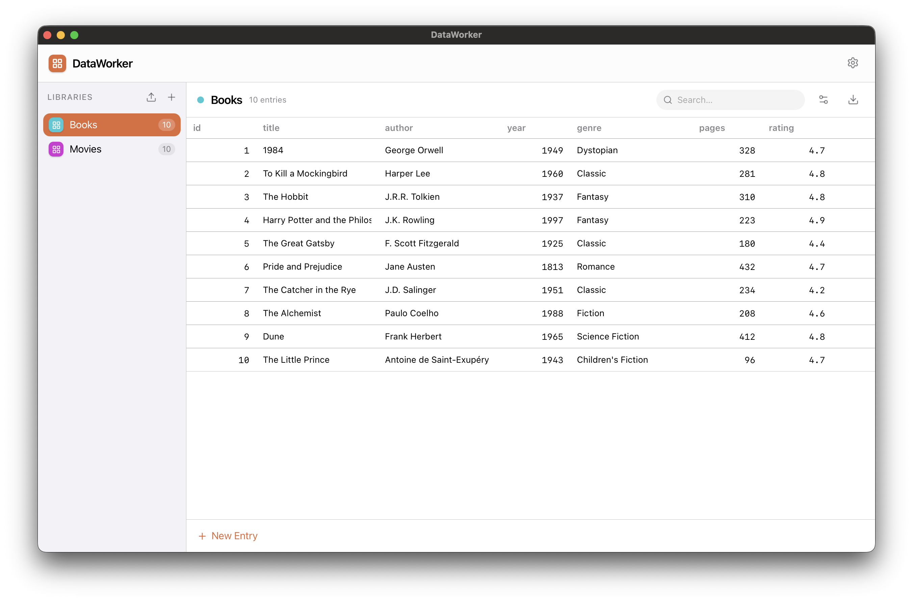
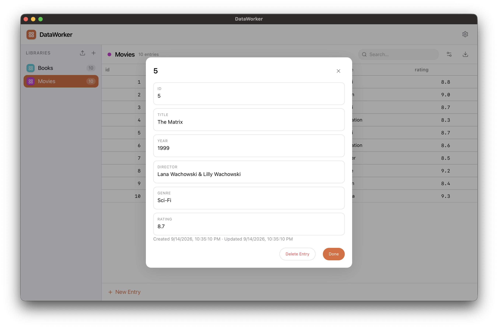

<div align="center">


# DataWorker

**A simple, local database for macOS — inspired by Bento.**

[Download](https://github.com/BennoCrafter/DataWorker/releases) ·
[Report an Issue](https://github.com/BennoCrafter/DataWorker/issues)

</div>

---

## About

**DataWorker** is a modern and simple replacement for **Bento**, the discontinued personal database app by FileMaker/Claris.

Bento made it easy to create small, flexible databases without a complicated setup. DataWorker follows the same idea:

* Create a **library** for anything you want to organize
* Add your own fields
* Enter and edit records directly in a table
* Basic sort and search your data
* Import existing Bento CSV exports
* Export your libraries back to CSV
* Keep everything **local on your Mac**

## Preview

|                  Library                 |            Detail view            |
| :--------------------------------------: | :------------------------------: |
|  |  |
|     Create and manage your libraries     |     Edit and organize records    |


## Getting Started

### Download

Download the latest version from the **[Releases page](https://github.com/BennoCrafter/DataWorker/releases)**.

### Build from source

DataWorker uses [Deno](https://deno.com/).

```sh
deno task build
```

This builds the application into a standalone executable and `.app` bundle.

For development, run:

```sh
deno task start
```

This launches DataWorker in its own application window.

You can also run the web version in your system browser:

```sh
deno task serve
```


### Import a Bento library

If you have an old Bento CSV export you can import it into DataWorker with ease.

You can also import CSV files that weren't originally created by Bento, as long as they contain a suitable tabular structure with the delimiter of ";".

## Data Storage

DataWorker stores everything locally on your Mac.

Each library is stored as a separate JSON file in:

```text
~/Library/Application Support/dataworker/libraries/
```

Because the data is stored as plain JSON, it is also straightforward to back up your libraries manually.

## Project Structure

| File                       | Description                                                      |
| -------------------------- | ---------------------------------------------------------------- |
| `server/library.ts`        | Data model for libraries, fields, and records, plus JSON storage |
| `server/csv.ts`            | Bento CSV parsing, field-type detection, and CSV export          |
| `server/library-routes.ts` | `/api/libraries*` and `/api/import-csv` HTTP routes              |
| `ui/js/library.js`         | Main library UI, including the sidebar, table, and modals        |

## Commands

| Command              | Description                                                  |
| -------------------- | ------------------------------------------------------------ |
| `deno task start`    | Run DataWorker in its native application window              |
| `deno task serve`    | Run DataWorker in the system browser                         |
| `deno task check`    | Type-check every entry point                                 |
| `deno task build`    | Build the standalone binary and `.app` in `dist/`            |
| `deno task notarize` | Sign, notarize, and staple the `.app`                        |
| `deno task publish`  | Publish the built and notarized app to the `releases` branch |
| `deno task release`  | Run `build` → `notarize` → `publish`                         |

## Releasing

To create and publish a new build:

```sh
deno task release
```

This runs the complete release pipeline:

```text
build → notarize → publish
```

### Publishing

`deno task publish` can also be run independently after manually building and notarizing the application.

The command force-pushes a single fresh commit containing only the zipped `.app` and its manifest to the `releases` branch.

The branch is intentionally history-free so repeated releases don't cause the repository to accumulate another ~60 MB blob for every version.

See [`scripts/publish.ts`](scripts/publish.ts) for the implementation and rationale.

> **Do not edit the `releases` branch manually.**

## Requirements

* macOS
* [Deno](https://deno.com/) for building from source
* An Apple Developer ID is required for the notarization step

## License

See the repository for license information.
